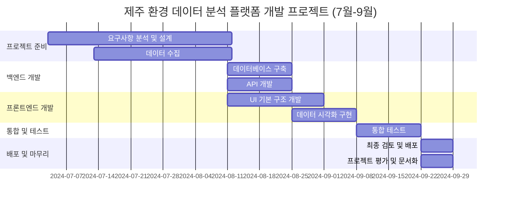

# 제주 빅데이터 시각화 프로젝트

* 도민이 참여하는, 시민이 참여하는 데이터 참여 공간으로 이 공간이 활용되길 원합니다.
* 데이터가 주민에게 주는 긍정적인 효과가 어떤 것이 우리가 짐작할 수는 없지만, 이런 데이터가 모여서 어떤 효과 를 발휘하는지 지켜보는 것도 우리에게 큰 학습 포인트가 될 것 같습니다.

## 배포 URL
* [jejudata.com](https://jejudata.com)

## 데이터

* 채팅채널에 있는 데이터 채널에 모아주시면 분석해서 업로드 합니다. 데이터 분석팀에서 스키마 정해서 업로드 및 크롤링을 하면 프론트엔드 팀에서 시각화를 합니다.
* Route330에 입주해있는 항공우주 기업들의 데이터를 받아 시각화

## 지원

* 제주 RIS 사업단에서 지원을 하고 싶다는 연락이 왔습니다. 추후 프로젝트 고도화를 위해 오프라인 모임이 필요하다면 지원이 가능하다 합니다.

## 협업

* 협업: GitHub(GitHub PR => merge, 별도 리뷰는 없습니다.)
* 크롤링, 데이터 생성: GitHub Action + Python => Python으로 JSON 형태의 데이터 생성(데이터 팀에서 스키마 정한대로)
* 프론트: HTML, CSS, JS(바닐라), JSON 파일을 fetch를 통해 시각화
* 라이브러리: (택 2 ~ 3) Chatjs, D3, 네이버지도, 구글지도, folium, apexcharts
* 시민참여: 백엔드가 들어가게
             

## 진행방식
* 역할 및 팀 분배: ~7월 28일
* 팀장 정하기: 8월 4일
* 팀마다 회의와 개발을 진행, 팀별 마일스톤 달성
* 팀별 WBS는 8월 4일까지 작성하여 GitHub에 업로드

## 팀
### 기획
    * 구성원: 없음
### 디자인팀
    * 피그마로 데이터 팀에서 간단하게 구상한 것을 시각화(없으면 디자인 없이 갑니다.)
    * 구성원: 없음
### 크롤링, 데이터 생성 팀
    * 시각화 할 필요가 있는 데이터 선별, 데이터 스키마 설정, 데이터에 따른 그래프 지정, 데이터 크롤링 및 데이터 생성
    * 구성원
        * 이인영(2innnnn0@kakao.com)
        * 신재현
        * 김하연(hayeonkimmie@gmail.com)
        * 임홍광
        * 정민규(cubone0417@gmail.com)
        * 우정균
        * 김동석(bloomingds1@gmail.com)
        * 김진(kimlynnjean@naver.com)
        * 이승민(0283esm@naver.com)
### 프론트 팀
    * 생성된 데이터를 시각화
    * 디자인팀이 없으므로 템플릿이나 직접 디자인 한 것으로 가져가야 합니다.
    * 구성원
        * 김민기
        * 임홍광

### 시민참여팀
    * 아이디어만 시민참여팀에 업로드(GitHub을 전혀 다루지 못하시는 분)
### 아이디어팀
    * 모두가 다 아이디어 팀입니다. 좋은 아이디어 있으면 올려주세요.

## 프로젝트 기간
* 최장 3개월
* 만약 의미있는 결과물이 1기에서 안나올 경우 2기로 넘기는 것을 생각하고 있습니다.
* 다음 회의까지 팀을 정하는 것을 유보하겠습니다. 미리 참여 의사를 밝혀주셔도 됩니다.

### WBS

## 데이터 큐레이션

코딩은 LLM이 거의 다 합니다. 우리가 어떤 것을 큐레이션 할지 의사결정 하는 것이 가장 큰 부분을 차지합니다. 어떤 데이터를 어떻게 시각화 할지 모두 고민해보시고, 데이터를 찾아봐주세요.

## 엑팅 포인트
1. 깃헙주소를 github아이디 공유 방에 업로드 해주세요.
2. URL 구매할껀데 url방에 아이디어 주세요.

## 참고 repo
* https://github.com/weniv/init_jsProjectBaseCode (베이스 코드)
* https://github.com/StopWarKr/stopwar (크롤링 코드)
* https://github.com/weniv/project_sample_repo (기획 코드)

## 매주 진행 방식
* 8월 11일 부터
    * 매주 팀별 진행사항 발표
    * 지원이 필요한 부분이 있다면 회의에서 위니브로 전달하면 리소스를 마련해 보도록 하겠습니다.
        * 자금
        * 디자인
        * 소스코드(막히는 부분)
* 가장 먼저 회의 해야 하는 팀
    * 데이터 분석팀
